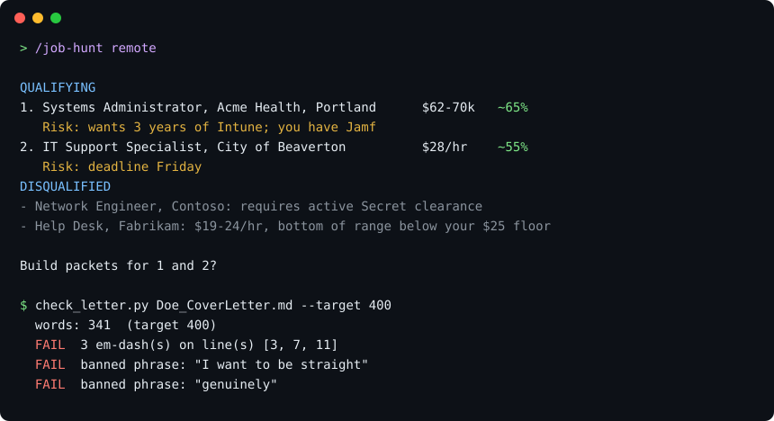

# job-hunting

[](LICENSE)




An agent skill that runs a job search end to end: find and screen live
postings, build tailored application packets (resume + cover letter + internal
job notes) in the candidate's own voice, track everything in an Excel sheet,
sweep Gmail for status changes, and prepare interview materials.

What makes it different from "write me a cover letter":

- **Voice is measured, not assumed.** It counts word length and em-dash usage
  across your real past letters and enforces that baseline with a linter.
- **Claims boundary.** A list of things you must never assert, built by asking
  you the uncomfortable questions once. Every letter is checked against it.
- **Hard filters first.** Pay floor and schedule constraints disqualify
  postings before any writing happens, and odds are stated before building.
- **It never sends anything.** Letters, follow-ups, and answers are drafts.
  You submit and send.

Works with Claude Code, OpenAI Codex CLI, and any agent that can read a
`SKILL.md` and run shell commands. See [AGENTS.md](AGENTS.md) for non-Claude
agents.

---

## 1. Install

### Requirements

| Need | Why | macOS | Linux | Windows |
|---|---|---|---|---|
| Python 3.9+ | tracker and letter checker | `brew install python` | usually preinstalled | `winget install Python.Python.3.12` |
| pandoc | markdown to docx/pdf | `brew install pandoc` | `apt install pandoc` | `winget install JohnMacFarlane.Pandoc` |
| xelatex | pdf engine | `brew install --cask mactex-no-gui` | `apt install texlive-xetex` | `winget install MiKTeX.MiKTeX` |
| git + bash | cloning, and the `.sh` scripts | `xcode-select --install` | `apt install git` | `winget install Git.Git` (includes Git Bash) |

The Python scripts create their own virtual environment with `openpyxl` on
first run. You do not need to `pip install` anything.

### Get the skill

**Claude Code, as a plugin (easiest).** Inside Claude Code:

```
/plugin marketplace add mitchasegura-ux/job-hunt
/plugin install job-hunting@job-hunt
```

Updates come through `/plugin`. If another plugin already uses a command name
like `/job-hunt`, use the prefixed form `/job-hunting:job-hunt`.

**Claude Code or Codex, from a clone:**

```bash
git clone https://github.com/mitchasegura-ux/job-hunt.git
cd job-hunt
./install.sh
```

**Windows** (PowerShell, from the cloned folder):

```powershell
powershell -ExecutionPolicy Bypass -File .\install.ps1
```

`install.sh` symlinks the skill and its commands into place, so a later
`git pull` updates every install. Pick one agent with `./install.sh claude` or
`./install.sh codex` (Windows: `.\install.ps1 claude`). On Windows the skill
folder is linked but the command files are copied, so rerun `install.ps1` after
a `git pull`. Agents on Windows run the `.sh` scripts through Git Bash.

| Agent | Skill lands in | Commands land in | You type |
|---|---|---|---|
| Claude Code | `~/.claude/skills/job-hunting` | `~/.claude/commands/` | `/job-init` |
| Codex CLI | `~/.codex/skills/job-hunting` | `~/.codex/prompts/` | `/prompts:job-init` |
| Other agents | point them at `SKILL.md` and `AGENTS.md` | n/a | "run job-init" |

For Claude.ai or ChatGPT on the web, zip this folder and upload it as a skill
where supported. The scripts need a code-execution environment there, and Gmail
sweeps need that app's Gmail connector.

Restart your agent after installing so it picks up the new skill and commands.

### Optional connections

These make the skill much more useful but are not required:

- **A job-search tool or connector** in your agent (used by `/job-hunt`).
  Without one, the agent checks employer career portals directly. It will not
  scrape Indeed or LinkedIn, which block automated traffic quickly.
- **Gmail access** (used by `/update-sheet` and `/interview-prep`). Without
  it, paste the relevant emails into the chat.

---

## 2. Set up your workspace with `/job-init`

Everything the skill knows about you lives in one folder you choose, the
**workspace**. This repo holds only the skill. Your resumes and applications
never go in here.

```bash
mkdir ~/JobSearch && cd ~/JobSearch
claude            # or: codex
```

Then run:

```
/job-init
```

or point it somewhere else with `/job-init ~/Documents/JobSearch2026`.

### What it asks you

`/job-init` asks for the things that act as hard filters on every future
search. Answer carefully: a wrong pay floor quietly throws away good postings
for weeks.

| It asks | Example answer | Used for |
|---|---|---|
| Your name, contact info, file prefix | Jane Doe, `Doe` | resume header, `Doe_Resume.pdf` |
| Pay floor | $25/hr or $55k/yr | disqualifies postings, including ranges whose *bottom* is below it |
| Schedule limits | no weekend shifts, on-call OK | disqualifies scheduled weekend roles |
| Locations | Portland, Beaverton, remote | search matrix |
| Career tracks and titles | IT support; AV technician | search queries, one base resume per track |
| Hard gates | no security clearance | auto-disqualifies postings that require it |
| Font, sizes, margins | Helvetica Neue, defaults | how resumes and letters render to PDF (it checks the font is installed) |
| Where existing files live | "my resumes are in `~/Documents/CVs`" | config points at them instead of moving them |

### What it creates

```
~/JobSearch/
├── jobsearch.config.yml     your answers above (see jobsearch.config.example.yml)
├── Application_Tracking.xlsx   the tracker, with status dropdowns and a Summary sheet
├── Applications/            one folder per job, created later by /job-hunt
├── resume/
│   ├── MASTER.md            filled in by /job-profile
│   └── base/                one resume per track, filled in by /job-profile
└── cover-letters/
    └── TEMPLATE.md          your measured voice rules, filled in by /job-profile
```

If you already have resumes, letters, or a tracker somewhere else, `/job-init`
writes the config to point at them. It does not move or rename your files.

### Next: `/job-profile`

`/job-init` finishes by pointing you here. This is the step everything else
depends on, so give it about 30 minutes.

```
/job-profile ~/Documents/OldResumesAndLetters
```

Have ready:

1. Your current resume (pdf, docx, or md)
2. As many past cover letters as you have. More letters give a better voice
   baseline. Five is workable, twenty is great.
3. A few sentences on what you want next

It will:

- Build `resume/MASTER.md`, every bullet you can truthfully claim, tagged by
  track.
- **Ask you uncomfortable questions** to build the claims boundary: "Your
  resume says you led a team. Did you have direct reports?" "Did you configure
  that system or only use it?" Answer honestly. This list is what keeps
  tailored resumes from drifting into claims that fall apart in an interview.
- Measure your past letters (average word count, em-dash usage, your real
  openers and closers) and write those numbers into the config, so
  `check_letter.py` enforces *your* baseline.
- Write one filtered base resume per career track.

---

## 3. Day-to-day examples

### Find jobs and build packets

```
/job-hunt
/job-hunt last 3 days
/job-hunt remote only
/job-hunt AV track, Beaverton
```

You get a shortlist first, before anything is written:

```
QUALIFYING
1. Systems Administrator, Acme Health, Portland   $62-70k   ~65%
   Risk: wants 3 years of Intune; you have Jamf.
2. IT Support Specialist, City of Beaverton       $28/hr    ~55%
   Risk: deadline Friday.

DISQUALIFIED
- Network Engineer, Contoso: requires active Secret clearance
- Help Desk, Fabrikam: $19-24/hr, bottom of range below your $25 floor

Build packets for 1 and 2?
```

Say "skip 2" or "build both." Each packet lands in
`Applications/<Title> - <Company> - <City>/` with a tailored resume, a cover
letter checked against your voice rules, and an internal `JOB.md` with the odds
and warnings (never rendered, never sent).

### Check where things stand

```
/job-status
```

Counts by status, then what the spreadsheet cannot tell you: deadlines this
week, packets built but never submitted, applications quiet for two weeks, and
the single most useful next action.

### Update the tracker from email

```
/update-sheet
/update-sheet last 14 days
```

Reads receipts, rejections, and interview invites, updates each row, and tells
you what did *not* change. It also flags employer messages sent through job
boards, which you cannot see until you log in.

### Answer an application question

```
/job-answer Why are you a good fit for this role? (Acme Health, 1500 characters max)
```

Returns an answer in your voice with its word and character count, plus a
shorter version if it is near the limit.

### Follow up on quiet applications

```
/job-followup
/job-followup 3 weeks
/job-followup Acme Health
```

Drafts four or five sentences per application. Nothing is sent.

### Prepare for an interview

```
/interview-prep Acme Health
```

First works out who is interviewing you (an outsourced recruiter's 30-minute
screen and a hiring manager's technical round need different preparation).
Then writes two files into the packet folder:

- `Interview_Prep.md`: paste into a voice-mode assistant for a strict mock
  interview that scores every answer and cuts you off at 90 seconds.
- `Interview_Reference_Card.pdf`: two printed pages to keep in front of you,
  with scripted opening lines, a salary answer, and a story bank.

### Use the scripts directly

Every script works without an agent:

```bash
SKILL_DIR=~/.claude/skills/job-hunting
PY=$(bash $SKILL_DIR/scripts/ensure_venv.sh)

$PY $SKILL_DIR/scripts/tracker.py report Application_Tracking.xlsx
$PY $SKILL_DIR/scripts/tracker.py set-status Application_Tracking.xlsx --company "Acme" --status Interview
$PY $SKILL_DIR/scripts/check_letter.py "Applications/.../Doe_CoverLetter.md" --target 400 --boundary resume/MASTER.md
bash $SKILL_DIR/scripts/render.sh "Applications/Systems Administrator - Acme Health - Portland"
```

---

## Commands

| Command | Does |
|---|---|
| `/job-init [dir]` | Create the workspace, tracker, and config |
| `/job-profile [materials-dir]` | Build master profile, claims boundary, base resumes, voice rules |
| `/job-hunt [filter]` | Search, screen, shortlist with odds, build packets |
| `/job-status` | Tracker report plus deadlines, unsent packets, stale applications |
| `/update-sheet [window]` | Sweep Gmail and update application statuses |
| `/job-answer <question>` | Answer one free-text application question |
| `/job-followup [threshold or company]` | Draft follow-ups for quiet applications |
| `/interview-prep <company>` | Mock-interviewer prompt plus a 2-page reference card |

## Troubleshooting

| Symptom | Cause and fix |
|---|---|
| `REFUSING TO WRITE: Microsoft Excel is running` | Excel's next save would erase the change. Quit Excel and rerun. |
| Rows you added disappeared | Same cause: Excel was open during the write. |
| `PDF RENDER FAILED` mentioning a font | The font in `formatting.font` is not installed. Change it in `jobsearch.config.yml`, or leave it empty for the default. |
| `expected 2, TRIM IT` after rendering | The resume ran long. Ask the agent to trim it. |
| `externally-managed-environment` from pip | Use the python that `ensure_venv.sh` prints, not system python. |
| Slash commands do not appear | Restart the agent after `./install.sh`. In Codex, type `/prompts:`. |

## Repo layout

```
SKILL.md                     router and rules (entry point for every agent)
AGENTS.md                    extra instructions for Codex and other agents
commands/                    slash-command entry points
references/                  loaded on demand: search method, packet anatomy,
                             voice rules, tracker schema, interview materials
scripts/
  tracker.py                 owns the .xlsx tracker
  check_letter.py            cover-letter linter: em-dashes, length, AI tells, claims boundary
  render.sh                  md -> docx/pdf, page-count check, deletes rendered JOB.*
  new_packet.sh              scaffolds one application folder
  pdf_pages.py               PDF page count with no dependencies
  ensure_venv.sh             creates the skill's python venv
jobsearch.config.example.yml
install.sh                   macOS / Linux installer
install.ps1                  Windows installer
.claude-plugin/               Claude Code plugin + marketplace manifests
docs/demo.svg                README demo image
```

## Privacy

Your resume, tracker, config, and applications live in your workspace, not in
this repo. `.gitignore` blocks the common personal files in case you run the
skill from inside the clone.

## License

[MIT](LICENSE)
